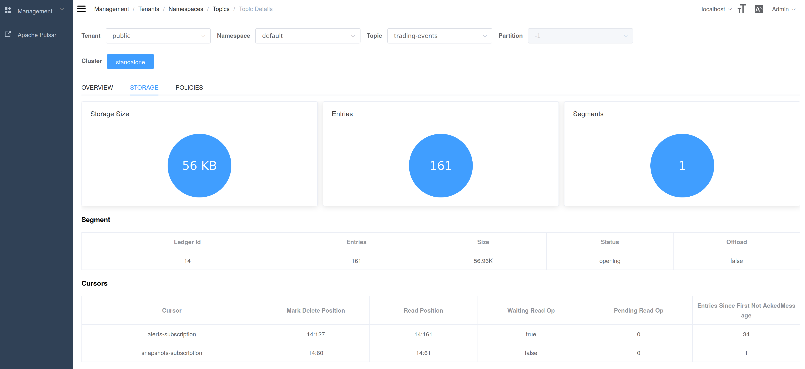
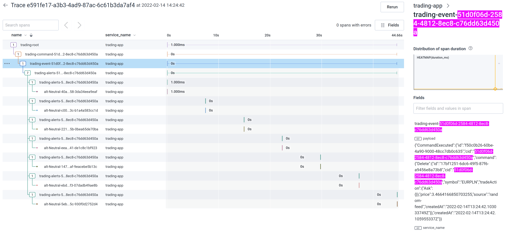
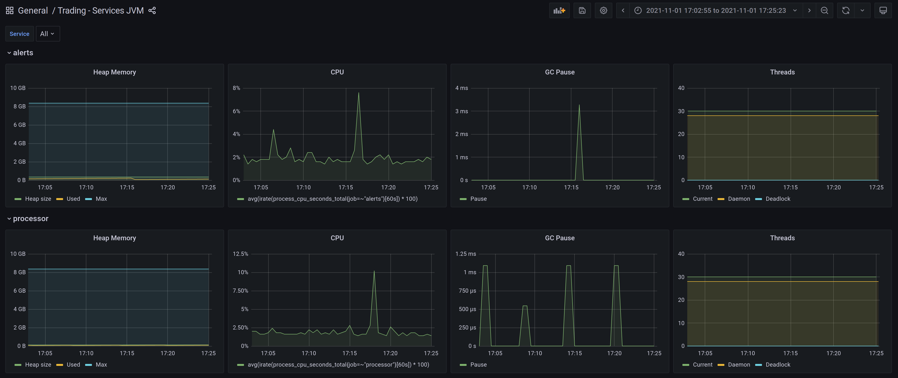

trading
=======

[](https://github.com/gvolpe/trading/actions)
[](https://github.com/gvolpe/trading/actions)
[](https://github.com/gvolpe/trading/actions/workflows/ci-smokey.yml)
[](https://mergify.io)

Reference application developed in the [Functional event-driven architecture: Powered by Scala 3](https://leanpub.com/feda) book.

## Table of contents

* [Web App](#web-app)
   * [ScalaJS](#scalajs)
* [Overview](#overview)
* [Requirements](#requirements)
* [Services](#services)
   * [Lib](#lib)
   * [Domain](#domain)
   * [Core](#core)
   * [Feed](#feed)
   * [Forecasts](#forecasts)
   * [Processor](#processor)
   * [Snapshots](#snapshots)
   * [Alerts](#alerts)
   * [WS Server](#ws-server)
   * [Tracing](#tracing)
   * [Tests](#tests)
   * [X Demo](#x-demo)
* [Monitoring](#monitoring)

## Web App

The web application allows users to subscribe/unsubscribe to/from symbol alerts such as `EURUSD`, which are emitted in real-time via Web Sockets.


It is written in [Elm](https://elm-lang.org/) and can be built as follows.

```shell
$ cd web-app && nix-build
$ xdg-open result/index.html # or specify browser
```

There's also a `shell.nix` handy for local development.

```shell
$ cd web-app && nix-shell
$ elm make src/Main.elm --output=Main.js
$ xdg-open index.html # or specify browser
```

If Nix is not your jam, you can install Elm by following the [official instructions](https://guide.elm-lang.org/install/elm.html) and then compile as usual.

```shell
$ cd web-app
$ elm make src/Main.elm --output=Main.js
$ xdg-open index.html # or specify browser
```

### ScalaJS

There is also a replica of the Elm application written in Scala using the [Tyrian](https://tyrian.indigoengine.io/) framework. You can run it via Nix as follows (it requires [flakes](https://nixos.wiki/wiki/Flakes)).

```console
$ cd modules/ws-client && nix develop
$ yarn start
yarn run v1.22.17
warning package.json: No license field
parcel index.html --no-cache --dist-dir dist --log-level info
Server running at http://localhost:1234
✨ Built in 1.82s
```

Or without Nix, you need to run these commands before (requires `yarn` and `parcel`).

```console
$ yarn install
$ yarn build
```

## Overview

Here's an overview of all the components of the system.


- Dotted lines: Pulsar messages such as commands and events.
- Bold lines: read and writes from / to external components (Redis, Postgres, etc).

## Requirements

The back-end application is structured as a mono-repo, and it requires both Apache Pulsar and Redis up and running. To make things easier, you can use the provided `docker-compose.yml` file.

Note: The `docker-compose` file depends on declared services to be published on the local docker server. All docker builds are handled within the `build.sbt` using `sbt-native-packager`. To build all of the service images, run `sbt docker:publishLocal`.

```shell
$ docker-compose up -d pulsar redis
```



To run the Kafka Demo (see more below), only Zookeeper and Kafka are needed.

```shell
$ docker-compose -f kafka.yml up
```

### Running application

If we don't specify any arguments, then all the containers will be started, including all our services (except `feed`), Prometheus, Grafana, and Pulsar Manager.

```shell
$ docker-compose up
Creating network "trading_app" with the default driver
Creating trading_pulsar_1 ... done
Creating trading_redis_1  ... done
Creating trading_ws-server_1      ... done
Creating trading_pulsar-manager_1 ... done
Creating trading_alerts_1         ... done
Creating trading_processor_1      ... done
Creating trading_snapshots_1      ... done
Creating trading_forecasts_1      ... done
Creating trading_tracing_1        ... done
Creating trading_prometheus_1     ... done
Creating trading_grafana_1        ... done
```

It is recommended to run the `feed` service directly from `sbt` whenever necessary, which publishes random data to the topics where other services are consuming messages from.

## Services

The back-end application consists of 9 modules, from which 5 are deployable applications, and 3 are just shared modules. There's also a demo module and a web application.

```
modules
├── alerts
├── core
├── domain
├── feed
├── forecasts
├── it
├── lib
├── processor
├── snapshots
├── tracing
├── ws-client
├── ws-server
└── x-demo
```


### Lib

Capability traits such as `Logger`, `Time`, `GenUUID`, and potential library abstractions such as `Consumer` and `Producer`, which abstract over different implementations such as Kafka and Pulsar.

### Domain

Commands, events, state, and all business-related data modeling.

### Core

Core functionality that needs to be shared across different modules such as snapshots, `AppTopic`, and `TradeEngine`.

### Feed

Generates random `TradeCommand`s and `ForecastCommand`s followed by publishing them to the corresponding topics. In the absence of real input data, this random feed puts the entire system to work.

### Forecasts

Registers new authors and forecasts, while calculating the author's reputation.

### Processor

The brain of the trading application. It consumes `TradeCommand`s, processes them to generate a `TradeState` and emitting `TradeEvent`s via the `trading-events` topic.

### Snapshots

It consumes `TradeEvent`s and recreates the `TradeState` that is persisted as a snapshot, running as a single instance in fail-over mode.

### Alerts

The alerts engine consumes `TradeEvent`s and emits `Alert` messages such as `Buy`, `StrongBuy` or `Sell` via the `trading-alerts` topic, according to the configured parameters.

### WS Server

It consumes `Alert` messages and sends them over Web Sockets whenever there's an active subscription for the alert.

### Tracing

A decentralized application that hooks up on multiple topics and creates traces via the Open Tracing protocol, using the Natchez library and Honeycomb.



### Tests

All unit tests can be executed via `sbt test`. There's also a small suite of integration tests that can be executed via `sbt it/test` (it requires Redis to be up).

### X Demo

It contains all the standalone examples shown in the book. It also showcases both `KafkaDemo` and `MemDemo` programs that use the same `Consumer` and `Producer` abstractions defined in the `lib` module.

### X QA

It contains the `smokey` project that models the smoke test for trading.

## Monitoring

JVM stats are provided for every service via Prometheus and Grafana.



## Topic compaction

Two Pulsar topics can be compacted to speed-up reads on startup, corresponding to `Alert` and `TradeEvent.Switch`.

To compact a topic on demand (useful for manual testing), run these commands.

```console
$ docker-compose exec pulsar bin/pulsar-admin topics compact persistent://public/default/trading-alerts
Topic compaction requested for persistent://public/default/trading-alerts.
$ docker-compose exec pulsar bin/pulsar-admin topics compact persistent://public/default/trading-switch-events
Topic compaction requested for persistent://public/default/trading-switch-events
```

In production, one would configure topic compaction to be triggered automatically at the namespace level when certain threshold is reached. For example, to trigger compaction when the backlog reaches 10MB:

```console
$ docker-compose exec pulsar bin/pulsar-admin namespaces set-compaction-threshold --threshold 10M public/default
```
