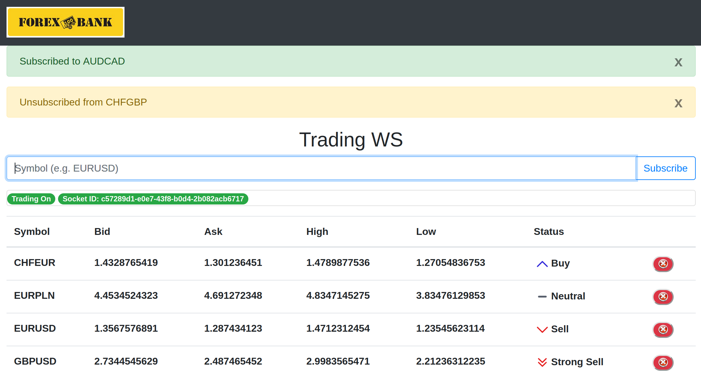

trading
=======

[](https://github.com/gvolpe/trading/actions)
[](https://github.com/gvolpe/trading/actions)
[](https://mergify.io)

Examples corresponding to the [Functional event-driven architecture: Powered by Scala 3](https://leanpub.com/feda) book.

## Table of contents

* [Web App](#web-app)
* [Requirements](#requirements)
* [Services](#services)
   * [Lib](#lib)
   * [Domain](#domain)
   * [Core](#core)
   * [Feed](#feed)
   * [Processor](#processor)
   * [Snapshots](#snapshots)
   * [Alerts](#alerts)
   * [WS Server](#ws-server)
   * [X Demo](#x-demo)

## Web App

The web application allows users to subscribe/unsubscribe to/from symbol alerts such as `EURUSD`, which are emitted in real-time via Web Sockets.



It is written in [Elm](https://elm-lang.org/) and can be built as follows.

```shell
$ cd web-app && nix-build
$ xdg-open result/index.html # or specify browser
```

There's also a `shell.nix` handy for local development.

```shell
$ cd web-app && nix-shell
$ elm make src/Main.elm --output=Main.js
$ xdg-open index.html # or specify browser
```

If Nix is not your jam, you can install Elm by following the [official instructions](https://guide.elm-lang.org/install/elm.html) and then compile as usual.

```shell
$ cd web-app
$ elm make src/Main.elm --output=Main.js
$ xdg-open index.html # or specify browser
```

## Requirements

The back-end application is structured as a mono-repo, and it requires both Apache Pulsar and Redis up and running. To make things easier, you can use the provided `docker-compose.yml` file.

```shell
$ docker-compose up
```

To run the Kafka Demo (see more below), only Zookeeper and Kafka are needed.

```shell
$ docker-compose -f kafka.yml up
```

Notice that there's another `docker-compose.yml` under `modules/` that starts both Pulsar and Redis, as well as all the application in its own network, if you're only after running the entire application instead of doing local development.

## Services

The back-end application consists of 8 modules, from which 5 are deployable applications, and 3 are just shared modules. There's also a demo module and a web application.

```
modules
├── alerts
├── core
├── domain
├── feed
├── lib
├── processor
├── snapshots
├── ws-server
└── x-demo
```


### Lib

Capability traits such as `Time` and potential library abstractions such as `Consumer` and `Producer`, which abstract over different implementations such as Kafka and Pulsar. Also generic typeclass instances such as `cats.Inject` based on Circe.

### Domain

Commands, events, state, and all business-related data modeling.

### Core

Core functionality that needs to be shared across different modules such as snapshots, `AppTopic`, and `EventSource`.

### Feed

Generates random `TradeCommand`s such as `Create` or `Delete` and publishes them to the `trading-commands` topic.

### Processor

The brain of the trading application. It consumes `TradeCommand`s, processes them to generate a `TradeState` and emitting `TradeEvent`s via the `trading-events` topic.

### Snapshots

It consumes `TradeEvent`s and recreates the `TradeState` that is persisted as a snapshot, running as a single instance in fail-over mode.

### Alerts

The alerts engine consumes `TradeEvent`s and emits `Alert` messages such as `Buy`, `StrongBuy` or `Sell` via the `trading-alerts` topic, according to the configured parameters.

### WS Server

It consumes `Alert` messages and sends them over Web Sockets whenever there's an active subscription for the alert.

### X Demo

It contains all the standalone examples shown in the book as well. It also showcases both `KafkaDemo` and `MemDemo` programs that use the same `Consumer` and `Producer` abstractions defined in the `lib` module. I
